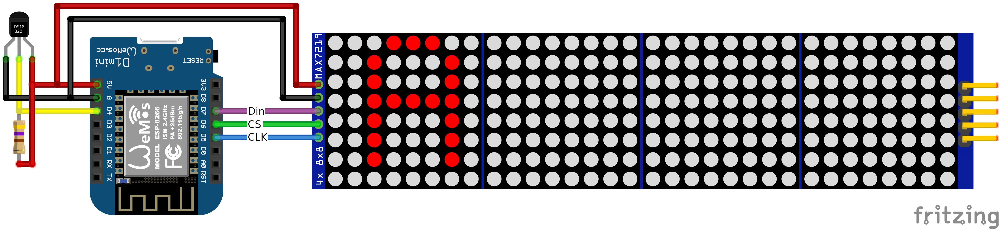

# wledPixel


MAX7219 LED dot matrix display driven by an ESP32 or ESP8266 MCU.

<a href="https://github.com/widapro/wled-pixel-v2/releases" target="_blank">The latest firmware version can be found in Releases</a>


## Supported key features:
1. **Home Assistant client** [display sensor values]
2. **OpenWeatherMap client** [display: temperature (C/F), humidity, pressure, wind speed, weather icon]
3. **MQTT client** [each display zone support own topic]
4. Display controll through MQTT
5. **Wall NTP clock** [NTP sync clock]
6. **Manual input**
7. Countdown timer
8. Full controll through **web UI**
9. Home Assistant MQTT discovery [When MQTT settings specified, device will be automatically send discovery message to HA]
10. Control display as light in Home Assistant [MQTT setup required]
11. Initial setup through wifi AP and web UI
12. Support 4 independent display zones
13. Support up to 12 display segments at the same time [configured in web UI]
14. Included 3 different fonts
15. Plus symbols font

##### Ingredients:
1. Dot matrix display MAX7219, something like this: <a href="https://aliexpress.com/item/32618155357.html" target="_blank">https://aliexpress.com/item/32618155357.html</a>
2. ESP32 or WeMos D1 Mini (ESP8266), something like this: <a href="https://aliexpress.com/item/32651747570.html" target="_blank">https://aliexpress.com/item/32651747570.html</a>

### 3D Printed Case
- **3D Printed Case**: Download from <a href="https://www.printables.com/model/1565724-wledpixel-smart-wifi-led-matrix-clock-info-display" target="_blank">Printables</a>

## Fonts
### Compact + Symbols
This font allows you to display text alongside icons within a single message.

This font allows accessing special icons using the `~` prefix followed by a specific character.

#### Compact + Symbols Font Mapping

Mapped by `~` + `Character`.

| Code | Index | Symbol | Code | Index | Symbol |
| :--- | :--- | :--- | :--- | :--- | :--- |
| `~!` | 129 | Battery Empty | `~G` | 167 | Key |
| `~"` | 130 | Battery 25% | `~H` | 168 | Male |
| `~#` | 131 | Battery 50% | `~I` | 169 | Alarm |
| `~$` | 132 | Battery 75% | `~J` | 170 | Clock |
| `~%` | 133 | Battery Full | `~K` | 171 | Garbage |
| `~0` | 144 | WLED Logo | `~M` | 173 | Moon |
| `~1` | 145 | X Symbol | `~N` | 174 | Message |
| `~2` | 146 | Stop | `~O` | 175 | Reminder |
| `~3` | 147 | Rain | `~S` | 179 | Sun |
| `~4` | 148 | IP Icon | `~T` | 180 | Thunderstorm |
| `~8` | 152 | Full Block | `~c` | 195 | Scattered Clouds |
| `~A` | 161 | Calendar | `~f` | 198 | Mist / Fog |
| `~B` | 162 | Windows Logo | `~m` | 205 | Few Clouds (Night) |
| `~C` | 163 | Broken Clouds | `~r` | 210 | Rain |
| `~D` | 164 | Door | `~s` | 211 | Few Clouds (Sun) |
| `~E` | 165 | Female | `~P` | 224 | P Icon |
| `~F` | 166 | Snow | `~@` | 230 | @ Symbol |

### Wled font
Support Germany alphabet


### Cyrilic font
Support Cyrilic alphabet


### Icons in Wled symbol font:


#### Symbol Font Mapping

This font maps standard ASCII characters directly to icons.

| Input | Index | Symbol | Input | Index | Symbol |
| :--- | :--- | :--- | :--- | :--- | :--- |
| `0` | 48 | WLED Logo | `K` | 75 | Garbage |
| `1` | 49 | X Symbol | `M` | 77 | Moon |
| `2` | 50 | Stop | `N` | 78 | Message |
| `3` | 51 | Rain | `O` | 79 | Reminder |
| `4` | 52 | IP Icon | `P` | 80 | P Icon |
| `8` | 56 | Full Block | `R` | 82 | Shower Rain |
| `A` | 65 | Calendar | `S` | 83 | Sun |
| `B` | 66 | Windows Logo | `T` | 84 | Thunderstorm |
| `C` | 67 | Broken Clouds | `c` | 99 | Scattered Clouds |
| `D` | 68 | Door | `f` | 102 | Mist / Fog |
| `E` | 69 | Female | `m` | 109 | Few Clouds (Night) |
| `F` | 70 | Snow | `r` | 114 | Rain |
| `G` | 71 | Key | `s` | 115 | Few Clouds (Sun) |
| `H` | 72 | Male | `DEL` | 127 | Hollow Up Arrow |
| `I` | 73 | Alarm | `°` | 176 | Degree Symbol |
| `J` | 74 | Clock | | | |


## Web UI - Settings


## Hardware GPIO for external devices, hardcoded:

### ESP32
```
// Display pinout
#define DATA_PIN  23         // ESP32 GPIO23
#define CS_PIN    5          // ESP32 GPIO5
#define CLK_PIN   18         // ESP32 GPIO18

// Ds18b20 pinout
const int oneWireBus = 4;    // ESP32 GPIO04
```

### ESP8266
```
// Display pinout
#define DATA_PIN  D7         // WeMos D1 mini or ESP8266 -> GPIO13
#define CS_PIN    D6         // WeMos D1 mini or ESP8266 -> GPIO12
#define CLK_PIN   D5         // WeMos D1 mini or ESP8266 -> GPIO14

// Ds18b20 pinout
const int oneWireBus = D4;   // WeMos D1 mini or ESP8266 -> GPIO02
```


## Wiring


## First boot:
> - Device will boot in wifi access point mode and show "AP Mode" on the display.
> - AP wifi name: **wledPixel-[short MAC address]**
> - AP wifi password: **12345678**
> - Connect to this AP and configure your wifi settings (connect to your wifi network)
> - When the device connects to the WIFI network, the device's IP address will be displayed on the zone0
> - Open the browser and go to the device IP address

## Building from Source

### Prerequisites
- <a href="https://platformio.org/install" target="_blank">PlatformIO</a> (VSCode extension or CLI)
- Git

### Build Steps

1. **Clone the repository:**
   ```bash
   git clone https://github.com/widapro/wledPixel.git
   cd wledPixel
   ```

2. **Build for ESP32:**
   ```bash
   pio run -e esp32
   ```

3. **Build for ESP8266 (D1 Mini):**
   ```bash
   pio run -e d1_mini
   ```

4. **Upload firmware:**
   ```bash
   # For ESP32
   pio run -e esp32 -t upload

   # For ESP8266
   pio run -e d1_mini -t upload
   ```

5. **Monitor serial output:**
   ```bash
   pio device monitor -b 115200
   ```

### Troubleshooting

If the device gets stuck at boot, erase the flash memory:
```bash
pio run -e esp32 -t erase
pio run -e esp32 -t upload
```


## API
```
/api/temperature      - get measured temperature from connected ds18b20 sensor
```

## MQTT Topics

**Topic Structure:** `[devicePrefix]/[zone]/[command]`
*   **devicePrefix**: `wledPixel-{shortMAC}` (e.g., `wledPixel-A071`)
*   **zone**: `zoneN` where N is 0, 1, 2, or 3.

### Zone Parameters

| Topic Suffix | Description | Payload / Values |
| :--- | :--- | :--- |
| `/text` | Zone text | Text to display (active when `workmode=mqttClient`) |
| `/scrolleffectIn` | Scroll effect IN | Effect name (e.g., `PA_PRINT`) |
| `/scrolleffectOut` | Scroll effect OUT | Effect name |
| `/scrollspeed` | Scroll speed | `0` - `100` |
| `/scrollpause` | Scroll pause | Seconds |
| `/scrollalign` | Scroll alignment | `PA_LEFT`, `PA_CENTER`, `PA_RIGHT` |
| `/charspacing` | Character spacing | Pixels |
| `/workmode` | Zone work mode | `mqttClient`, `manualInput`, `wallClock`, `countdown`, `wopr`, etc. |
| `/scrollInfinite` | Infinite scroll | `ON`/`OFF`, `true`/`false`, `1`/`0` |

### Global Parameters

| Topic Suffix | Description | Values |
| :--- | :--- | :--- |
| `/intensity` | Brightness | `0` - `15` |
| `/power` | Power control | `ON` / `OFF` |

### Countdown Configuration

#### Set Target Time
*   **Topic:** `.../zoneN/countdown`
*   **Payload:** String with date/time.

**Supported Formats:**
| Format | Example | Description |
| :--- | :--- | :--- |
| `YYYY-MM-DDTHH:MM:SS` | `2026-12-31T23:59:59` | Full ISO format |
| `YYYY-MM-DDTHH:MM` | `2026-12-31T23:59` | ISO without seconds |
| `YYYY-MM-DD` | `2026-12-31` | Date only (Time: 00:00:00) |
| `HH:MM:SS` | `23:59:59` | Time only (Date: Today) |

#### Display Format
*   **Topic:** `.../zoneN/countdownFormat`
*   **Payload:** Format token string.

**Options:**
*   **Basic:** `SS` (seconds), `MM` (minutes), `HH` (hours), `DD` (days)
*   **Combined:** `HHMM`, `HHMMSS`, `DDHH`, `DDHHMM`, `DDHHMMSS`
*   **Calendar:** `YY` (years), `YYMM`, `YYMMDDHHMM`, `YYMMDDHHMMSS`
*   **Automatic:** `auto` (hides zero leading units)

where **devicePrefix** = wledPixel-A071
**zoneN** = zone number (e.g. Zone0, Zone1, Zone2, Zone3)

#### Supported workMode:
workMode supported values:
* `mqttClient`    - MQTT client
* `manualInput`   - Manual static text inputed in UI
* `wallClock`     - NTP sync clock
* `owmWeather`    - Open Weather Map client
* `haClient`      - Home Assistant client
* `wopr`          - WarGames effect
* `countdown`     - Countdown timer


## Display Behavior for MQTT and Manual Modes

Both **MQTT Client** and **Manual Input** modes share the same display logic:

### When the message **fits** on the screen:
- The message appears using the selected **IN effect**.
- **If Infinite Scroll is DISABLED**:
  - If **OUT effect** is `NO_EFFECT`: The message stays static on the display until a new message arrives.
  - If **OUT effect** is any other effect: The animation plays once (**IN** → **Scroll pause** → **OUT**) and then stops. The message does not repeat.
- **If Infinite Scroll is ENABLED**:
  - If **OUT effect** is `NO_EFFECT`: The message stays static on the display until a new message arrives.
  - If **OUT effect** is any other effect: The message loops continuously (**IN** → **Scroll pause** → **OUT** → repeat).

### When the message **does not fit** on the screen:
- It automatically scrolls to show the full text.
- If **Infinite Scroll** is enabled: It scrolls in a loop.
- If **Infinite Scroll** is disabled: It scrolls once and stops.

### Service Messages (e.g., "mqtt ok", "mqtt err", mode names)
- If a service message doesn't fit, it scrolls once and then remains static.
- Duplicate status messages are ignored to prevent flickering.
- Can be completely disabled via the **"Disable service messages"** setting.


## Wall clock
Wall clock mode support next following display options:
* `HH:MM`       - Hours : Minutes [21:43]
* `HH:MM:SS`    - Hours : Minutes : Seconds [21:43:54]
* `HH`          - Hours [21]
* `MM`          - Minutes [43]
* `dd.mm.yyyy`  - Day.Month.Year [21.06.2022]
* `dd.mm`       - Day.Month [21.06]
* `dd.mm aa`    - Day.Month weekday name (e.g., Sun) [21.06 Tue] *in Cyrillic font weekday name will be in Cyrillic
* `aa`          - Weekday name (e.g. Sun) *in Cyrillic font weekday name will be in Cyrillic

### Display Logic
* **If text fits in the zone:**
  - Displays statically.
  - Dots blink (unless disabled).
* **If text does NOT fit in the zone:**
  - Text scrolls completely until it disappears.
  - Screen remains blank for the duration of **Scroll Pause**.
  - Text starts scrolling again.
  - Dots do **NOT** blink to prevent interrupting the scroll cycle.

> **Note:** The **Scroll Effect Out** setting in the Web UI is disabled (greyed out) for Wall Clock mode because the loop animation doesn't use an exit effect.


## Scroll effect list
Default effects:
* `PA_RANDOM`
* `PA_PRINT`
* `PA_SCAN_HORIZ`
* `PA_SCROLL_LEFT`
* `PA_WIPE`
* `PA_SCAN_VERTX`
* `PA_SCROLL_UP_LEFT`
* `PA_SCROLL_UP`
* `PA_FADE`
* `PA_OPENING_CURSOR`
* `PA_GROW_UP`
* `PA_SCROLL_UP_RIGHT`
* `PA_BLINDS`
* `PA_CLOSING`
* `PA_GROW_DOWN`
* `PA_SCAN_VERT`
* `PA_SCROLL_DOWN_LEFT`
* `PA_WIPE_CURSOR`
* `PA_SCAN_HORIZX`
* `PA_DISSOLVE`
* `PA_MESH`
* `PA_OPENING`
* `PA_CLOSING_CURSOR`
* `PA_SCROLL_DOWN_RIGHT`
* `PA_SCROLL_RIGHT`
* `PA_SLICE`
* `PA_SCROLL_DOWN`
* `PA_SPRITE` (Generic)

### Custom effects (Sprites)
* `PACMAN`
* `WAVE`
* `ROLL`
* `LINES`
* `ARROW`
* `SAILBOAT`
* `STEAMBOAT`
* `HEART`
* `INVADER`
* `ROCKET`
* `FBALL`
* `CHEVRON`
* `WALKER`
* `MARIO` (New!)
* `GHOST` (New!)
* `DINO` (New!)


## Demo Video
<a href="https://youtu.be/0IlsjbE2lU0" target="_blank">Watch the effects demo on YouTube</a>


## Home Assistant automation example:
Send sensor value each time when a value has been changed
```
---
- alias: Outside temp change - send new temp to wled panel mqtt
  initial_state: 'on'
  trigger:
    platform: state
    entity_id: sensor.outside_thp_sensor_3
  action:
    - service: mqtt.publish
      data:
        topic: wledPixel-A071/zone0/text
        payload_template: "{{ states('sensor.outside_thp_sensor_3') }} C"
```
Change **wledPixel-A071** to device name with your prefix
